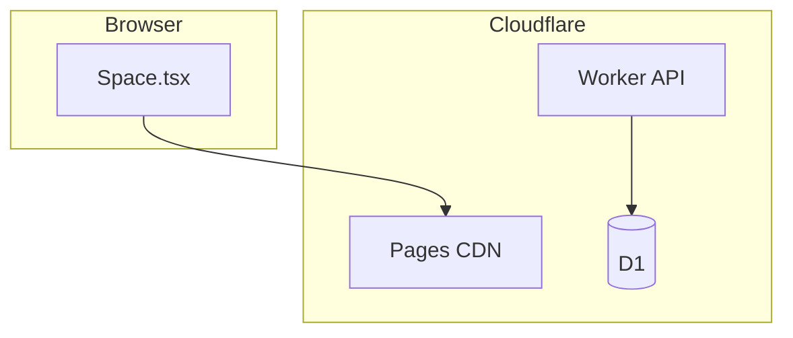

# システム構成

## 概要

- `/` は Pages が静的ファイル（`out/`）を配信
- `/api/*` は Worker（`public/_routes.json` で Pages から除外）。利用者 UI からは呼ばない

## Cloudflare 製品の役割

| 製品 | 用途 |
|---|---|
| Pages | 静的フロント（Next.js `output: 'export'`） |
| Workers | API、バリデーション、レート制限、予算ガード |
| D1 | heartbeat・visit・利用カウント |

Durable Objects は使わない。Workers Free 枠内で始めやすい構成。

## presence API（実装者向け）

`GET /api/presence` は Worker に残る（admin / visit 観察用）。利用者 UI からは polling しない。

- D1 `active_sessions` を upsert
- 終了した visit は Cron（5 分間隔）で `session_visits` に確定（[11-session-visits.md](./11-session-visits.md)）

## 予算ガード

利用者向け API の呼び出しを D1 `api_usage` で集計。上限で 503 + `static_only`。

| 項目 | 内容 |
|---|---|
| カウント対象 | `GET /api/presence`（legacy: `POST /api/words`） |
| カウントしない | admin API |
| 既定上限 | 日次 90,000 / 月次 9,000,000 |
| 手動停止 | `STATIC_ONLY_MODE=true` |
| 静的配信 | Pages は継続 |

利用者 UI は API を呼ばないため、`static_only` の影響を受けない。

## 料金の目安

静的配信（Pages）は帯域無料。API は Workers 課金に依存。

| シナリオ | 月間 API req 目安 | 月額目安 |
|---|---:|---:|
| 小規模（30 DAU） | ~1 万 | $0 |
| 順調（200 DAU） | ~6 万 | $0 |
| 注目（2,000 DAU） | ~60 万 | $5 |

1 セッション 10 分・60s ポーリング ≒ 10.3 req。上限到達後は API 停止・静的のみで $0 継続。
