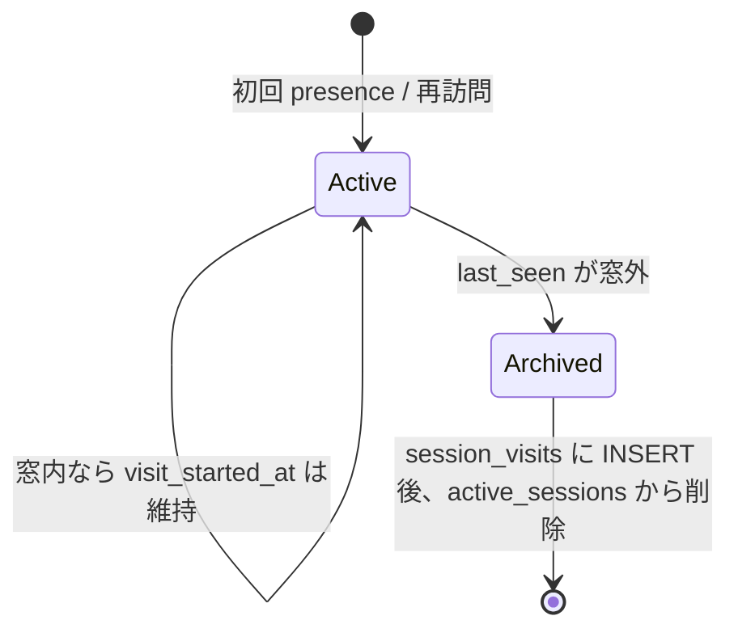

# セッション滞在の記録

## 背景

現状の `active_sessions` は「いま何人いるか」を数えるための**一時テーブル**で、`last_seen_at` のみを保持する。開始時刻・滞在秒数は残らない。

| 現状 | 課題 |
|---|---|
| `session_id` + `last_seen_at` | 開始時刻が上書きで消える |
| 300 秒無操作で行削除 | 離脱後に滞在時間を復元できない |
| Cookie は最大 30 日 | 同一 ID で複数回訪問しても「1 回の訪問」と区別できない |

本設計は、**匿名の訪問（visit）単位**で開始時刻と滞在秒数を残す。個人特定や行動追跡の拡張はしない。

## 用語

| 用語 | 意味 |
|---|---|
| `session_id` | HttpOnly Cookie の匿名 UUID（最大 30 日。既存どおり） |
| **visit（訪問）** | タブを開いてから、最後の presence から `PRESENCE_WINDOW_SEC` 経過するまでの一連の滞在 |
| **訪問の開始** | 新規 Cookie、または前回 `last_seen_at` が窓外になったあとの最初の presence |
| **訪問の終了** | `last_seen_at` が `now - PRESENCE_WINDOW_SEC` より古くなった時点（行の削除・確定時） |

同一 `session_id` で翌日また来れば、**別 visit** として複数行が残る。

## 設計方針

1. **リアルタイム人数用と履歴用を分離する** — `active_sessions` の役割は変えない
2. **終了した visit だけ永続化する** — 滞在中は `active_sessions` にだけ書く
3. **個人を特定しない** — IP・User-Agent・画面操作は紐づけない
4. **精度は polling 粒度で十分** — 終了時刻は「最後にサーバーが気づいた時刻」（最大約 60 秒の誤差）

## テーブル

### `active_sessions`（変更）

presence 用のホット行。visit 境界の判定に `visit_started_at` を追加する。

| 列 | 型 | 説明 |
|---|---|---|
| `session_id` | TEXT PK | 匿名セッション UUID |
| `visit_started_at` | INTEGER | **いまの visit** の開始 unix 秒（新 visit 時のみセット） |
| `last_seen_at` | INTEGER | 最終 `/api/presence` unix 秒 |

`last_seen_at >= cutoff` の `COUNT(*)` は従来どおり人数表示に使う。

### `session_visits`（新規）

確定した visit の履歴。admin の集計・設計レビュー用。

| 列 | 型 | 説明 |
|---|---|---|
| `id` | TEXT PK | visit ID（UUID。`session_id` とは別） |
| `session_id` | TEXT | Cookie の UUID（個人特定には使わない） |
| `started_at` | INTEGER | 訪問開始 unix 秒（= 確定時の `visit_started_at`） |
| `ended_at` | INTEGER | 訪問終了 unix 秒（= 確定時の `last_seen_at`） |
| `duration_sec` | INTEGER | `ended_at - started_at`（`CHECK (duration_sec >= 0)`） |
| `expires_at` | INTEGER | 削除予定 unix 秒 |

**意図的に持たない:** `ip_hash`, `user_agent`, `referrer`, ページ URL, イベント種別

インデックス:

- `idx_session_visits_started` — `started_at DESC`（admin 一覧）
- `idx_session_visits_expires` — `expires_at`（期限削除）

## visit のライフサイクル



### `GET /api/presence` の処理（案）

```
now = unix()
cutoff = now - PRESENCE_WINDOW_SEC
row = SELECT visit_started_at, last_seen_at FROM active_sessions WHERE session_id = ?

if row is null:
  UPSERT active_sessions (visit_started_at=now, last_seen_at=now)

elif row.last_seen_at < cutoff:
  // 前の visit を確定
  archive_visit(session_id, row.visit_started_at, row.last_seen_at, now)
  UPSERT active_sessions (visit_started_at=now, last_seen_at=now)

else:
  UPDATE last_seen_at = now  // visit_started_at はそのまま

count = COUNT(*) WHERE last_seen_at >= cutoff
// 窓外の確定・期限削除は Cron（runVisitMaintenance）が担当
```

### 確定（archive）のタイミング

| 経路 | きっかけ |
|---|---|
| A. 再訪問 | 同 `session_id` で窓外後に再度 presence が来た（Cron より先に戻った場合のみ API で 1 件確定） |
| B. Workers Cron | 5 分ごと（`wrangler.toml` `[triggers]`）。窓外の `active_sessions` を一括確定・削除 |

B が主経路。再訪問しない visit は最大約 `PRESENCE_WINDOW_SEC` + 5 分で `session_visits` に残る。Cron は Workers Free 枠で利用可（1 日 ~288 回）。

### `archive_visit` の中身

```sql
INSERT INTO session_visits (id, session_id, started_at, ended_at, duration_sec, expires_at)
VALUES (?, ?, ?, ?, ended_at - started_at, ended_at + SESSION_VISITS_RETENTION_SEC)
```

その後 `DELETE FROM active_sessions WHERE session_id = ?`（経路 A）または purge バッチで削除（経路 B）。

期限切れ visit・words は Cron の `runVisitMaintenance` で削除。

## 精度と限界

| 項目 | 値 |
|---|---|
| 開始時刻の誤差 | 初回 presence の時刻（ページ表示から最大約 1 polling 分遅れうる） |
| 終了時刻の誤差 | 最後の presence の時刻（タブを閉じても最大約 60 秒は「滞在中」に見える） |
| 最短 visit | 1 回だけ presence して離脱 → `duration_sec` は 0 に近い |
| 最長の「1 visit」 | タブを開きっぱなしで polling が続く限り延びる（上限なし） |

「何時にタブを閉じたか」ではなく「サーバーが最後に応答した時刻」として扱う。

## プライバシー・開示

| 誰が | 見えるもの |
|---|---|
| 利用者（画面） | 変化なし（人数のみ） |
| 他利用者 | 見えない |
| サービス運営者（admin） | `session_visits` の開始・終了・秒数。`session_id` で words と突合は**できるが推奨しない**（設計レビューは集計で足りる） |

`/privacy` に追記する文案（案）:

> 匿名の識別子ごとに、いつ頃場にいたか・およそ何秒いたかが、個人を特定できない形でサーバーに記録されることがあります。記録は一定期間経過後に削除されます。

## 設定

| 変数 | 既定 | 意味 |
|---|---|---|
| `SESSION_VISITS_RETENTION_SEC` | `31536000`（1 年） | visit 行の保持期間（`ended_at` 基準） |
| `PRESENCE_WINDOW_SEC` | `300`（既存） | visit 終了判定の無操作閾値 |

words と同じ 1 年でもよい。集計だけなら 90 日に短縮する選択肢あり。

## Admin API（案）

既存 Bearer 配下に追加。生ログの大量取得は避け、まず集計のみ。

### `GET /api/admin/session-stats`

```json
{
  "visitsStored": 1204,
  "last24h": {
    "visitCount": 42,
    "medianDurationSec": 180,
    "p90DurationSec": 720
  }
}
```

### `GET /api/admin/session-visits?limit=100`（任意）

運営者が個別行を見る用。`limit` 上限 500。将来必要になったら実装。

## マイグレーション

`0004_session_visits.sql`（0003 適用後）:

1. `active_sessions` に `visit_started_at` を追加（既存行は `last_seen_at` で backfill）
2. `session_visits` テーブル作成
3. インデックス作成

0002 適用済み DB では `active_sessions` は BLOB の可能性があるため、0003 の TEXT 変換後に 0004 を当てる。

## 実装状況

実装済み: `0004_session_visits.sql`, `worker/src/db/visits.ts`, `worker/src/scheduled.ts`, `worker/src/index.ts`（`scheduled`）, `worker/wrangler.toml`（`crons`）, `worker/src/routes/public.ts`, `worker/src/routes/admin.ts`, `app/privacy/page.tsx`

## あえてやらないこと

- visit ごとの IP 保存（スロットル用 `ip_hash` とは結合しない）
- クライアントからの滞在時間送信（改ざん可能なため）
- WebSocket / `beforeunload` による高精度終了（複雑さとプライバシーのトレードオフ）
- 利用者向け「あなたの滞在時間」表示
- `words.session_id` への visit ID 付与（必要になったら別設計）

## 関連

- [05-database.md](./05-database.md) — 全テーブル一覧
- [03-architecture.md](./03-architecture.md) — presence polling
- [09-security.md](./09-security.md) — 最小限の記録方針
